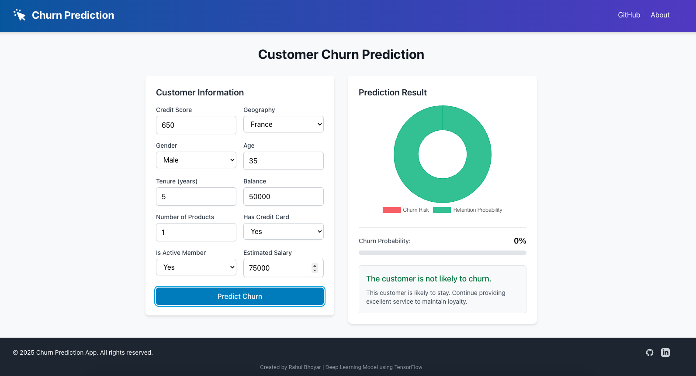

# Churn Prediction using Deep Learning


## Author: Rahul Bhoyar

A full-stack application that predicts customer churn using deep learning. This project uses TensorFlow for the machine learning model, FastAPI for the backend API, and React with Tailwind CSS for the frontend.

## Overview

Customer churn prediction is a critical task for businesses to identify customers who are likely to stop using their services. This application provides a user-friendly interface to input customer data and get real-time predictions on churn probability using a deep learning model.




## Features

- **Deep Learning Model**: Neural network trained on customer data to predict churn probability
- **Interactive UI**: Modern React frontend with form inputs for customer data
- **Real-time Prediction**: Instant prediction results with visualization
- **Dockerized**: Containerized application for easy deployment
- **Responsive Design**: Works on desktop and mobile devices

## Architecture

```ascii
┌─────────────┐     ┌─────────────┐     ┌─────────────┐
│             │     │             │     │             │
│   React     │────▶│   FastAPI   │────▶│ TensorFlow  │
│  Frontend   │     │   Backend   │     │    Model    │
│             │     │             │     │             │
└─────────────┘     └─────────────┘     └─────────────┘
      │                   │                   │
      │                   │                   │
      ▼                   ▼                   ▼
┌─────────────────────────────────────────────────────┐
│                     Docker Compose                   │
└─────────────────────────────────────────────────────┘
```

## Tech Stack

### Backend

- FastAPI (Python web framework)
- TensorFlow (Deep learning library)
- Scikit-learn (For data preprocessing)
- Pandas (Data manipulation)
- Docker (Containerization)

### Frontend

- React (JavaScript library)
- Tailwind CSS (Utility-first CSS framework)
- Chart.js (Data visualization)
- Axios (HTTP client)
- Docker (Containerization)

## Getting Started

### Prerequisites

- Docker and Docker Compose
- Git

### Installation and Setup

1. Clone the repository:

   ```bash
   git clone https://github.com/rahulbhoyar1995/Churn-Prediction-using-Deep-Learning.git
   cd Churn-Prediction-using-Deep-Learning
   ```

2. Start the application using Docker Compose:

   ```bash
   docker-compose up -d
   ```

3. Access the application:
   - Frontend: `http://localhost:3000`
   - Backend API: `http://localhost:8000`
   - API Documentation: `http://localhost:8000/docs`

### Development Setup

#### Backend Development

1. Create a virtual environment:

   ```bash
   cd backend
   python -m venv venv
   source venv/bin/activate  # On Windows: venv\Scripts\activate
   ```

2. Install dependencies:

   ```bash
   pip install -r requirements.txt
   ```

3. Run the FastAPI server:

   ```bash
   uvicorn app:app --reload
   ```

#### Frontend Development

1. Install dependencies:

   ```bash
   cd frontend
   npm install
   ```

2. Start the development server:

   ```bash
   npm start
   ```

## API Documentation

### Predict Churn Endpoint

- **URL**: `/predict-churn/`
- **Method**: POST
- **Request Body**:

  ```json
  {
    "credit_score": 650,
    "geography": "France",
    "gender": "Male",
    "age": 35,
    "tenure": 5,
    "balance": 50000,
    "num_of_products": 1,
    "has_cr_card": 1,
    "is_active_member": 1,
    "estimated_salary": 75000
  }
  ```

- **Response**:

  ```json
  {
    "churn_probability": 0.01,
    "churn_result": "The customer is not likely to churn."
  }
  ```

## Project Structure

```plaintext
churn-prediction-using-deep-learning/
├── backend/                  # FastAPI backend
│   ├── models/               # Trained model and encoders
│   ├── modelling/            # Jupyter notebooks for model development
│   ├── data/                 # Dataset files
│   ├── app.py                # Main FastAPI application
│   ├── requirements.txt      # Python dependencies
│   └── Dockerfile            # Backend Docker configuration
├── frontend/                 # React frontend
│   ├── public/               # Static files
│   ├── src/                  # Source code
│   │   ├── components/       # React components
│   │   ├── App.js            # Main application component
│   │   └── index.js          # Entry point
│   ├── package.json          # Node.js dependencies
│   └── Dockerfile            # Frontend Docker configuration
├── docker-compose.yml        # Docker Compose configuration
└── README.md                 # Project documentation
```

## Model Information

The churn prediction model is a neural network built with TensorFlow. It uses the following architecture:

- Input layer with customer features
- Hidden layers with ReLU activation
- Output layer with sigmoid activation for binary classification

The model was trained on a dataset of bank customer information with the following features:

- Credit Score
- Geography
- Gender
- Age
- Tenure
- Balance
- Number of Products
- Has Credit Card
- Is Active Member
- Estimated Salary

## Contributing

Contributions are welcome! Please feel free to submit a Pull Request.

1. Fork the repository
2. Create your feature branch (`git checkout -b feature/amazing-feature`)
3. Commit your changes (`git commit -m 'Add some amazing feature'`)
4. Push to the branch (`git push origin feature/amazing-feature`)
5. Open a Pull Request

## License

This project is licensed under the MIT License - see the LICENSE file for details.
